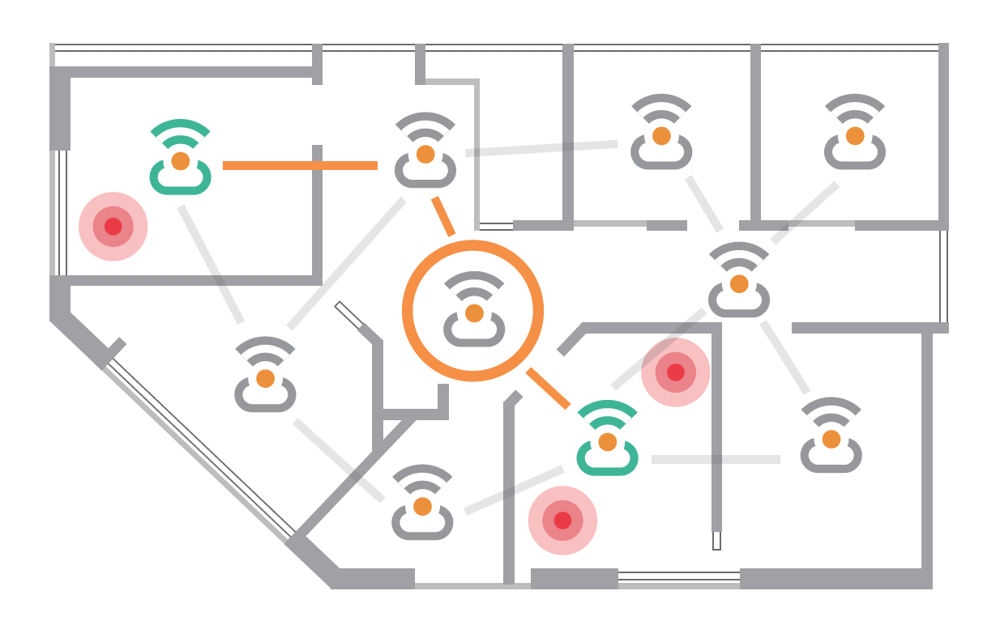

# Flutter Emergency App Made during Angel Hackathon
2019에 진행된 엔젤해커톤 결과물입니다.

재난이 발생할 때 대피를 하는 일은 매우 어려운 일입니다.

특히, 거동에 불편함이 있는 사람들이 많은 병원에서 재난시 잘 대피하는 것은 더더욱 어렵습니다.

골든 타임안에 구조를 하기 위해서는 환자들의 위치를 미리 파악하는 것이 매우 중요하다.

**Beap**은 비콘을 활용해서 병원내의 사람들의 위치를 파악하고 해당 정보를 모바일로 시각화해서 재난 구조에 도움을 주려는 서비스입니다.

**Beap**의 설계구조를 설명해줄 수 있는 설계도입니다. 환자들은 뱃지 형태의 비콘을 소지하고 있고 이 비콘은 주기적으로 수신기에 위치 정보를 송신합니다. 여러개의 수신기들은 그 정보를 모아서 하나의 게이트웨이에 전달을 하고 이 정보는 서버에 저장됩니다. 그리고 **Beap**의 모바일 어플리케이션은 해당 정보로 시각화된 정보를 제공합니다.

## App Result

> 메인화면에서 권한을 지닌 유저가 재난이 발생한 구조물에 대한 정보를 입력합니다.그러면 해당 건물에 대한 정보가 화면에 나타나게 됩니다.

 

> 버드뷰 혹은 3D뷰로 실시간으로 몇명이 건물에 있는지 확인할 수 있습니다. 즉, 비콘을 지닌 사람의 수가 건물내에 몇명있는지 알려주는 것입니다. 사람이 많은 남아서 대피 못한 순으로 빨강>노랑>초록 순으로 건물에 색이 표시됩니다.
> 밑에는 대피 현황을 보여줍니다.

> 건물을 누르면 그 건물의 층을 자세히 알려주고 층마다의 정보를 시각화해서 보여줍니다. 층을 누르면 그 층에 현재 위치한 비콘들의 모습을 보여줍니다.

